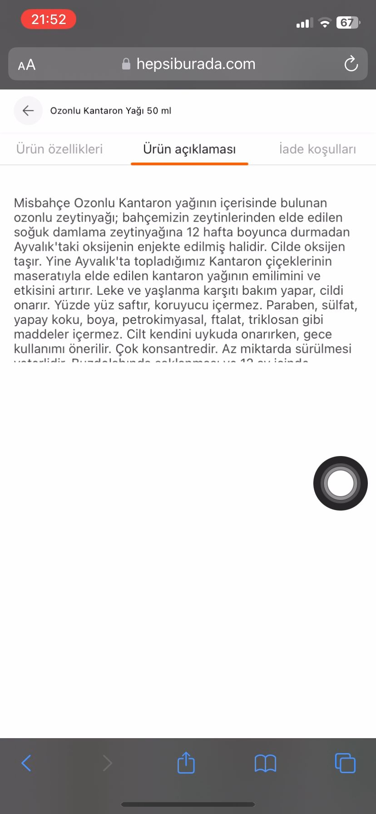

**Ürün Açıklama Metni Okunabilir Değil**

**Ön Koşullar:**

-

**Aşama:**

- Ürün Özellikleri

**Senaryo:**

1) Safari açılır. 
2) https://hepsiburada.com/ linkine girilir. 
3) Arama çubuğuna "Misbahçe Ozonlu Kantaron Yağı 50 ml" girilir. 
4) Arama sonucundan çıkan ilk ürüne tıklanır. 
5) Ürün özellikleri kısmına kadar sayfa aşağıya kaydırılır. 
6) "Ürünlerinizi 14 gün içerisinde iade edebilirsiniz. Detaylı bilgi için tıklayın." metinindeki "tıklayınız" butonuna tıklanır. 
7) Iade Koşulları sayfası görüntülendiği doğrulanır 
8) "Ürün Açıklaması" seçeneğine tıklanır.
9) Ürün Açıklama metini görüntülendiği doğrulanır. 

**Ekran Görüntüleri**

**Beklenen Sonuç:**

- Ürün açıklaması metninin, ekranda tam olarak görüntülenmesi ve kullanıcıların tüm açıklamayı okuyabilmesi gerekir. Metin, sayfa düzenine uygun şekilde tüm genişliği kapsamalı veya gerektiğinde bir kaydırma çubuğu sunulmalıdır.

**Oluşan Durum:**

- Ürün açıklaması metni yalnızca ekranın 1/3’ünde görünüyor. Metnin geri kalanı eksik kalıyor, bu da kullanıcıların ürünle ilgili tüm bilgilere ulaşmasını engelliyor ve sayfanın tasarımında bir hata olduğunu gösteriyor.

**Test Ortamı**

*Test cihazı:* Iphone 11

*Test cihazı sürümü:* iOS 17.6.1

*Test cihazı ekran çözünürlüğü:* 828x1792 px

*Uygulamanın test edildiği browser:* Safari 17.6.1 

*Sorunun Tekrarlanma Saati:* 06.09.2024 , 21:52