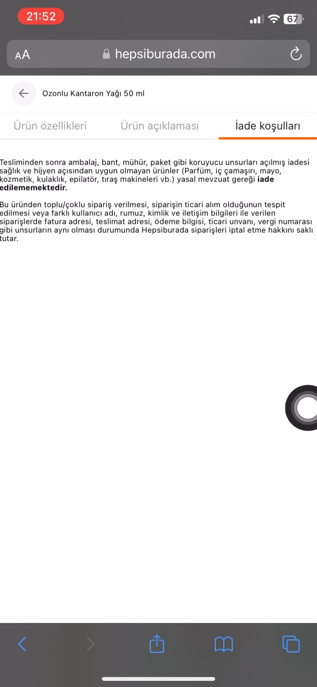

**Ürün İade Koşulları Metni Okunabilir Değil**

**Ön Koşullar:**

-

**Aşama:**

- Ürün Özellikleri

**Senaryo:**

1) Safari açılır. 
2) https://hepsiburada.com/ linkine girilir. 
3) Arama çubuğuna "Misbahçe Ozonlu Kantaron Yağı 50 ml" girilir. 
4) Arama sonucundan çıkan ilk ürüne tıklanır. 
5) Ürün özellikleri kısmına kadar sayfa aşağıya kaydırılır. 
6) "Ürünlerinizi 14 gün içerisinde iade edebilirsiniz. Detaylı bilgi için tıklayın." metinindeki "tıklayınız" butonuna tıklanır. 
7) Iade Koşulları sayfası görüntülendiği doğrulanır 

**Ekran Görüntüleri**

**Beklenen Sonuç:**

- Ürün iade koşulları metninin, kullanıcıların rahatça okuyabileceği ve anlayabileceği bir şekilde düzenlenmiş olması gerekir. Yazı boyutu, rengi ve arka plan uyumu düzgün olmalı; metin, her cihazda ve tarayıcıda açıkça okunabilir olmalıdır.

**Oluşan Durum:**

- Ürün iade koşulları metninin ilk kelimesi ekranın en başında, yarım bir şekilde görünüyor. Bu hizalama hatası, metnin tam olarak okunmasını engelliyor ve sayfanın tasarımında bir problem olduğunu gösteriyor.

**Test Ortamı**

*Test cihazı:* Iphone 11

*Test cihazı sürümü:* iOS 17.6.1

*Test cihazı ekran çözünürlüğü:* 828x1792 px

*Uygulamanın test edildiği browser:* Safari 17.6.1 

*Sorunun Tekrarlanma Saati:* 06.09.2024 , 21:52