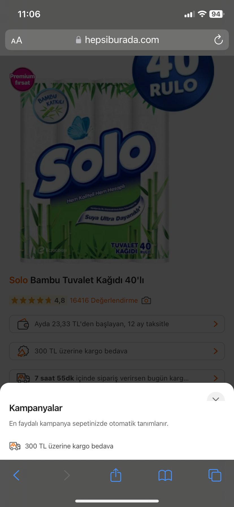

**Urune Ait Kampanya Secenegine Tiklandiginda Acilan Sayfanin Kapanmama Sorunu**

**Ön Koşullar:**

- 

**Aşama:**

- Ürün Sayfasi

**Senaryo:**

1) Safari açılır. 
2) https://hepsiburada.com/ linkine girilir. 
3) Arama çubuğuna "Solo Bambu Tuvalet Kağıdı 40'lı" girilir. 
4) Arama sonucundan çıkan ilk ürüne tıklanır. 
5) "300 TL üzerine kargo bedava" yazısına tıklanır. 
6) Açılan sekmede ayrıntılı bilgi sayfası açıldığı doğrulanır. 

**Ekran Görüntüleri**

**Beklenen Sonuç:**

- "300 TL üzerine kargo bedava" kampanya sekmesi açıldığında, kullanıcılar sekmeyi kapatabilmek için çarpı (X) butonuna tıklamalıdır. Çıkış butonunun düzgün çalışarak kullanıcıyı kampanya sekmesinden çıkarması gerekir.

**Oluşan Durum:**

- Çarpı (X) butonu tıklanmasına rağmen hiçbir tepki vermiyor, kullanıcı kampanya sekmesinden çıkış yapamıyor ve Çarpı (X) butonunun bir kısmı görünmüyor.

**Test Ortamı**

*Test cihazı:* Iphone 11

*Test cihazı sürümü:* iOS 17.6.1

*Test cihazı ekran çözünürlüğü:* 828x1792 px

*Uygulamanın test edildiği browser:* Safari 17.6.1 

*Sorunun Tekrarlanma Saati:* 07.09.2024 , 11:06