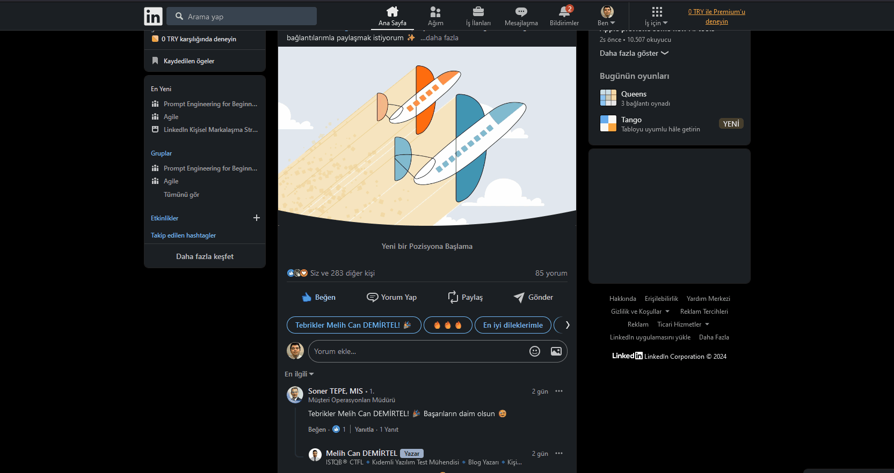

**"Daha Fazla Tebrik Şablonunu Görüntüleme Sorunu"**

**Ön Koşullar:**

- LinkedIn hesabına giriş yapılmış olmalı.

**Aşama:**

- LinkedIn ana sayfasında veya bir gönderi yorum alanında.

**Senaryo:**

1) Firefox açılır. 
2) https://www.linkedin.com/ linkine girilir. 
3) Linkedin akış sayfası üzerinde yeni işe giren bir kullanıcının gönderisi bulunur. 
4) "Yorum Yap" butonuna tıklanır. 
5) Hazır mesajlar kısmında "Daha fazla seçenek" simgesine (sağa doğru ok işareti) tıklanır. 

**Ekran Görüntüleri**

**Beklenen Sonuç:**

- Kullanıcı, "Daha fazla seçenek" simgesine tıkladığında, daha fazla tebrik şablonu yüklenmeli ve seçilebilir olmalıdır.

**Oluşan Durum:**

- Kullanıcı, "Daha fazla seçenek" simgesine tıkladığında, herhangi bir tepki vermiyor ve ek şablonlar görüntülenmiyor. Bu, kullanıcı deneyimini sınırlıyor ve diğer seçeneklere erişimi engelliyor.

**Test Ortamı**

*Test cihazı:* Intel i9-10850K - NVIDIA GEforce RTX 3070 - 16gb RAM

*Test cihazı sürümü:* Windows 11 23H2 IS derlemesi 22631.4037

*Test cihazı ekran çözünürlüğü:* 1920x 1080

*Uygulamanın test edildiği browser:* Firefox 132.0.2 (64 bit)

*Sorunun Tekrarlanma Saati:* 24.10.2024 , 15:32