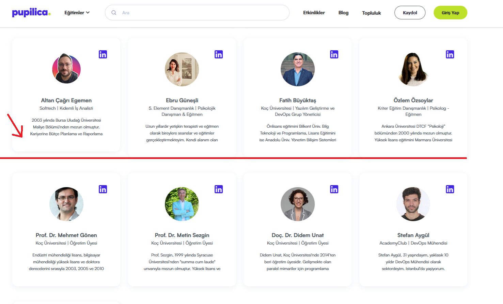

**Eğitmenler Sayfasindaki Egitmen Kartlarinin Orantılı Olmama Sorunu**

**Ön Koşullar:**

-

**Aşama:**

- Eğitmenler Sayfasi

**Senaryo:**

1) https://pupilica.com/ linkine girilir. 
2) Sayfanın en altına kadar kaydırılır. 
3) Eğitmenler butonuna tıklanır. 
4) Eğitmenler sayfasında yönlendirildiği doğrulanır. 

**Ekran Görüntüleri**

 
 

**Beklenen Sonuç:**

- Tüm eğitmen kartlarının boyutlarının orantılı ve tutarlı olması gerekir. Kartlar, her eğitmen için aynı yükseklik ve genişlikte olmalı.

**Oluşan Durum:**

- Ikinci ve üçüncü sıradaki eğitmen kartları orantılı değil.Bazı eğitmenlerin kartının yükseklikleri digerlerine kıyasla daha kısa.

**Test Ortamı**

*Test cihazı:* Intel i9-10850K - NVIDIA GEforce RTX 3070 - 16gb RAM

*Test cihazı sürümü:* Windows 11 23H2 IS derlemesi 22631.4037

*Test cihazı ekran çözünürlüğü:* 1920x 1080

*Uygulamanın test edildiği browser:* Firefox 129.0.2 (64 bit)

*Sorunun Tekrarlanma Saati:* 06.09.2024 , 21:24