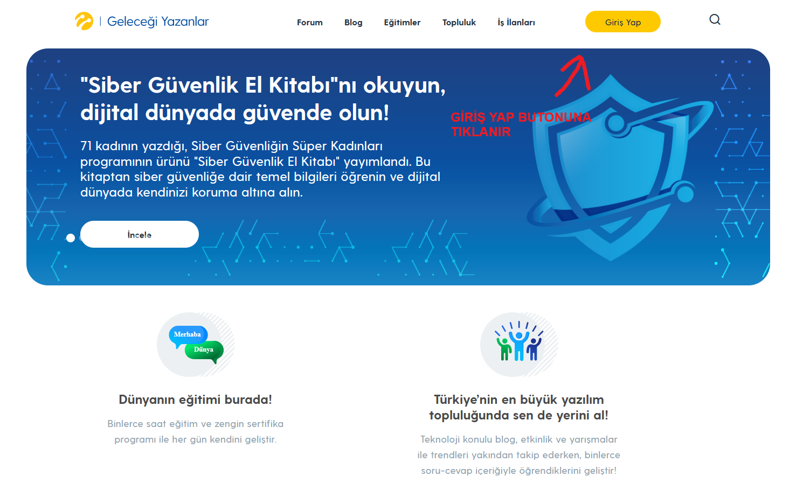
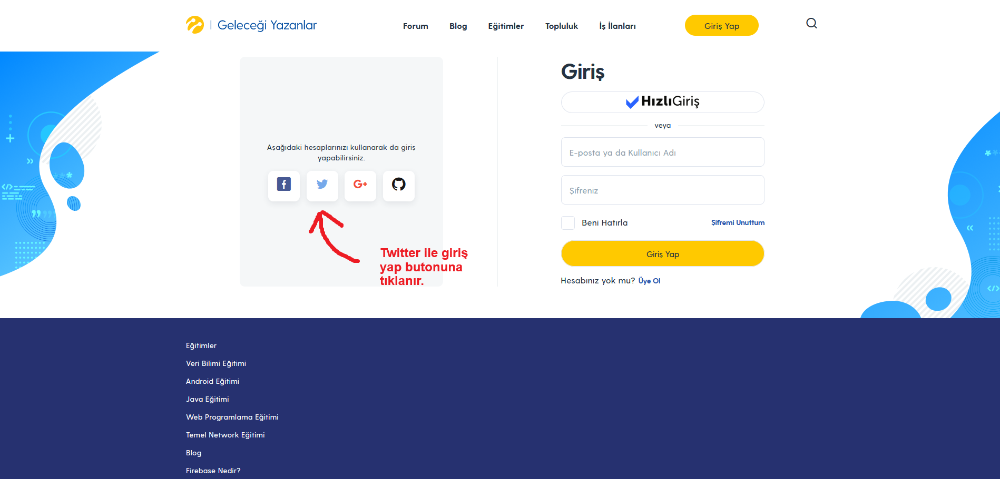
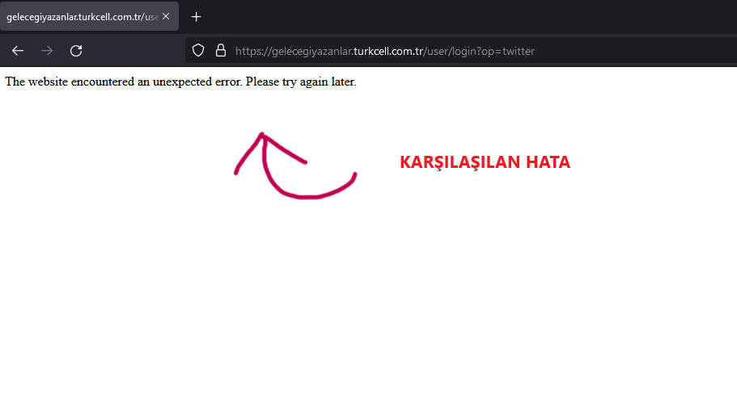
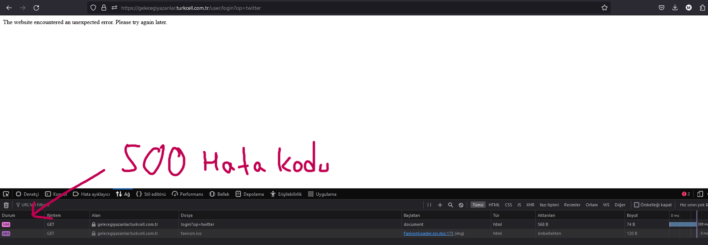

=  Twitter ile kayıt olma ve giriş sorunu

*Test cihazı:* Intel i9-10850K - NVIDIA GEforce RTX 3070 - 16gb RAM

*Test cihazı sürümü:* Windows 11 23h2 IS derlemesi 22631.3235

*Test cihazı ekran çözünürlüğü:* 1920x 1080

*Uygulamanın test edildiği browser:* Firefox 123.0 (64 bit)

*Sorunun Tekrarlanma Saati:* 04.03.2024 , 12:24

**Ön Koşullar:**

-Twitter Hesabının tarayıcıda login olması

**Aşama:**

- Giriş/Kayıt Olmak

**Senaryo:**

. https://gelecegiyazanlar.turkcell.com.tr/ linkine girilir. 
. "Giriş Yap" seçeneğine tıklanır. 
. "Aşağıdaki hesaplarınızı kullanarak da giriş yapabilirsiniz" yazan metinin altından "Twitter" butonu seçilir . 
. Twitter hesabı browserda login durumdaysa giriş yapması değilse Twitter a login formu gelmesi. 
. Giriş yaptıktan sonra 2Factor Dogrulama kodu girilir. 
. https://gelecegiyazanlar.turkcell.com.tr/benim-sayfam açılır 

**Oluşan Durum:**

. Twitterla giriş butonuna tıklandığında beyaz bir sayfada "The website encountered an unexpected error. Please try again later." uyarısı alınıyor ve sitedeki hesaba giriş yapılmıyor.Aynı sorun siteye kaydolurken de yaşanıyor.

**Beklenen Sonuç:**

- Twitterla giriş butonuna tıklandığında, hesaba giriş yapması ve https://gelecegiyazanlar.turkcell.com.tr/benim-sayfam a yönlendirmesi.

