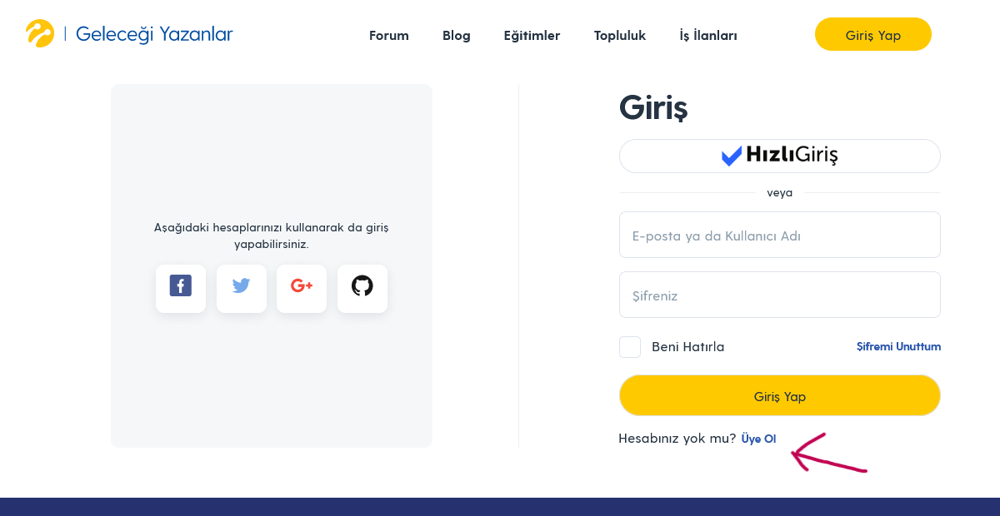

:imagesdir: images

=  Uye olma formu sorunu

*Test cihazı:* Intel i9-10850K - NVIDIA GEforce RTX 3070 - 16gb RAM

*Test cihazı sürümü:* Windows 11 23h2 IS derlemesi 22631.3235

*Test cihazı ekran çözünürlüğü:* 1920x 1080

*Uygulamanın test edildiği browser:* Firefox 123.0 (64 bit)

*Sorunun Tekrarlanma Saati:* 04.03.2024 , 12:24

**Ön Koşullar:**

-

**Aşama:**

- Kayıt Olmak

**Senaryo:**

. https://gelecegiyazanlar.turkcell.com.tr/ linkine girilir.
. "Giriş Yap" seçeneğine tıklanır.
. "Hesabınız yok mu?" metinin yanındaki üye ol butonuna basılır.
. https://gelecegiyazanlar.turkcell.com.tr/user/register adresine yönlendirilir.
. Üye olma formunun sorunsuz geldiği görüntülenir.

**Oluşan Durum:**

. https://gelecegiyazanlar.turkcell.com.tr/user/register aşamasında gelen üye olma formunu olusan bileşenlerden bir kod id'si site arayüzüne yansımıştır.data girilecek kısımlar düzgün hizalanmamıştır

**Beklenen Sonuç:**

- Kullanıcı https://gelecegiyazanlar.turkcell.com.tr/user/register aşamasına geldiğinde "phone_num" yazısı orada olmamalı ve data girilecek kısımlar düzgün hizalanmamıştır

