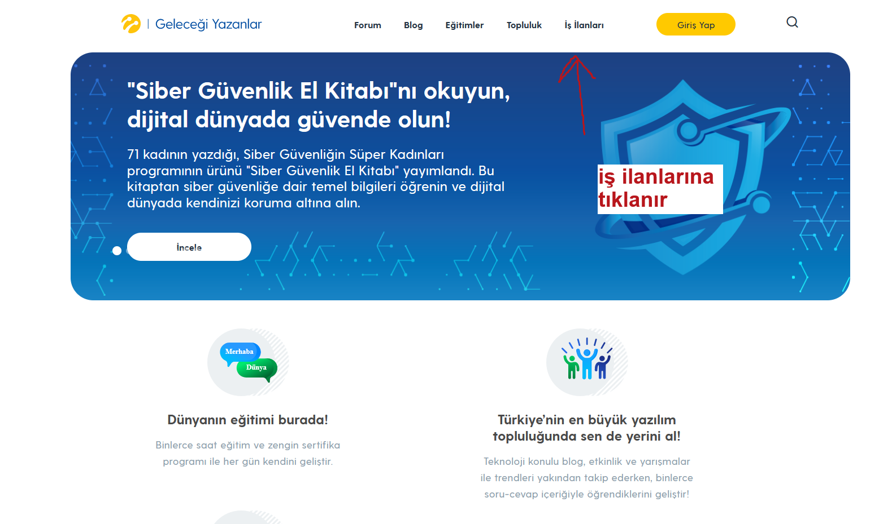
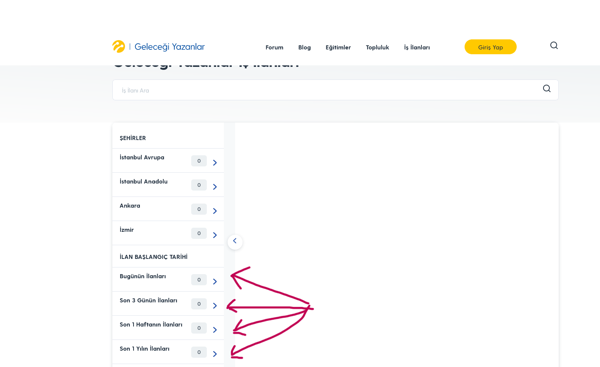
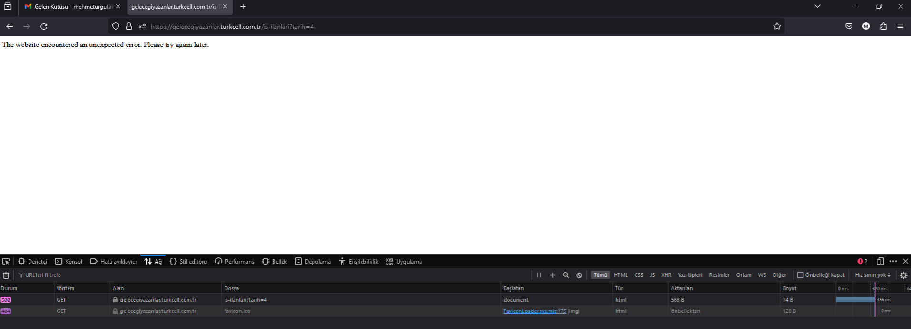

:imagesdir: images

=  Ilan baslangıç tarihi bölümündeki filtreleme butonlarının çalışmaması

*Test cihazı:* Intel i9-10850K - NVIDIA GEforce RTX 3070 - 16gb RAM

*Test cihazı sürümü:* Windows 11 23h2 IS derlemesi 22631.3235

*Test cihazı ekran çözünürlüğü:* 1920x 1080

*Uygulamanın test edildiği browser:* Firefox 123.0 (64 bit)

*Sorunun Tekrarlanma Saati:* 07.03.2024 , 105:46

**Ön Koşullar:**

-

**Aşama:**

- Filtreleme

**Senaryo:**

. https://gelecegiyazanlar.turkcell.com.tr/ linkine girilir.
. "İş İlanları" seçeneğine tıklanır.
. "İLAN BAŞLANGIÇ TARİHİ" bölümündeki "Bugünün İlanları" , "Son 3 Günün İlanları" , "Son 1 Haftanın İlanları" , "Son 1 Yılın Ilanları" filtreleme butonlarına tıklanır
. Tıklanan filtreleme seçeneğine göre ilanlar varsa ekrana getirilir yoksa ilan yoktur diye uyarı verir.

**Oluşan Durum:**

. Filtreleme butonuna basıldığında "The website encountered an unexpected error. Please try again later." 500 kodu hatası görülmüştür

**Beklenen Sonuç:**

- İş İlanlarının filtrelenmesi, eğer iş ilanı yoksa uyarı mesajı vermesi.

