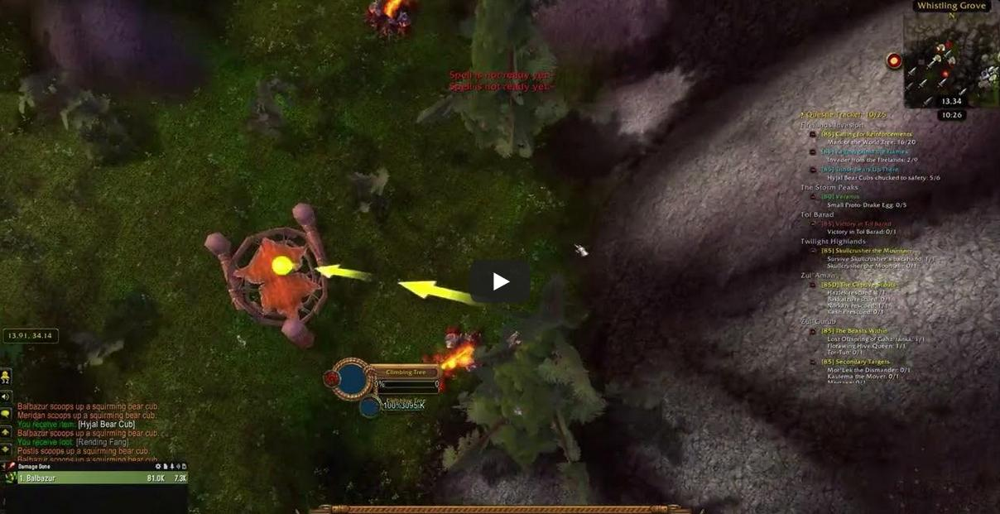

**Crash When Trying to Claim Rewards for the 'Those Bears Up There' Daily Quest**

**Preconditions:**

- Must have a level 85 character and purchased World Of Warcraft game time.

**Scenario:**

- Open the game World of Warcraft and log in with your character.

**Steps:**

1) Open the game World of Warcraft and log in with your character. 
2) Accept the 'Those Bears Up There' Daily Quest. 
3) Complete the quest by collecting all required items. 
4) Attempt to claim the quest rewards from the quest. 

**Screenshots:**

- Game Crash While Claiming Rewards for 'Those Bears Up There' Quest

- Re-Login, Character Falling with Fall Damage

**Expected Result:**

- After completing the quest, when the player clicks the button to claim the rewards, the rewards should be successfully received.

**Actual Result:**

- After completing the quest, when the player clicks the button to claim the rewards, the game freezes, and shortly after, the message "You have been disconnected from the server." appears. Upon re-entering the game, the character starts in mid-air, a bit far from the location where the disconnection occurred then falls and takes fall damage upon landing.

**Test Environment:**

*Device: Intel i9-10850K - NVIDIA GeForce RTX 3070 - 16GB RAM

*OS Version: Windows 11 23H2, Build 22631.4037

*Display Resolution: 1920x1080

*Battle.net Client Version: 2.29.0 (64-bit)

*World Of Warcraft Cataclym Classic Version: 4.4.0 - September 24, 2024 Hotfix patch (64-bit) 

*Issue Reproduction Time: 29.09.2024, 23:27
