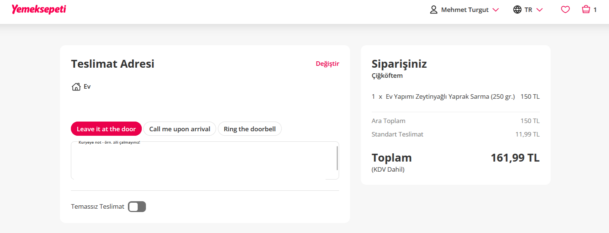

**Sipariş Onaylama Sayfası Arayüz Sorunu**

**Ön Koşullar:**

-Yemeksepeti hesabının olması

**Aşama:**

- Sipariş Onaylama

**Senaryo:**

. https://www.yemeksepeti.com linkine girilir. 
. Bir restorant seçilir. 
. Bir ürüne tıklanır . 
. Doldurulması zorunlu bölümler işaretlenir 
. "Sepete Ekle" butonuna tıklanır. 
. "Sepeti Onayla" butonuna tıklanır. 

**Ekran Görüntüleri**

 

**Beklenen Sonuç:**

- Sipariş onay sayfasında "Kapıya bırak" , "Varınca beni ara" , "Zili çal" kısımları Türkçe dilinde olmalı

**Oluşan Durum:**

- Sipariş onay sayfasında "Kapıya bırak" , "Varınca beni ara" , "Zili çal" kısımları "Leave it at the door" , "Call me upon arrival" , "Ring the doorbell" şeklinde ingilizce yazılmış

**Test Ortamı**

*Test cihazı:* Intel i9-10850K - NVIDIA GEforce RTX 3070 - 16gb RAM

*Test cihazı sürümü:* Windows 11 23H2 IS derlemesi 22631.3810

*Test cihazı ekran çözünürlüğü:* 1920x 1080

*Uygulamanın test edildiği browser:* Firefox 127.0.2 (64 bit)

*Sorunun Tekrarlanma Saati:* 01.07.2024 , 15:34
